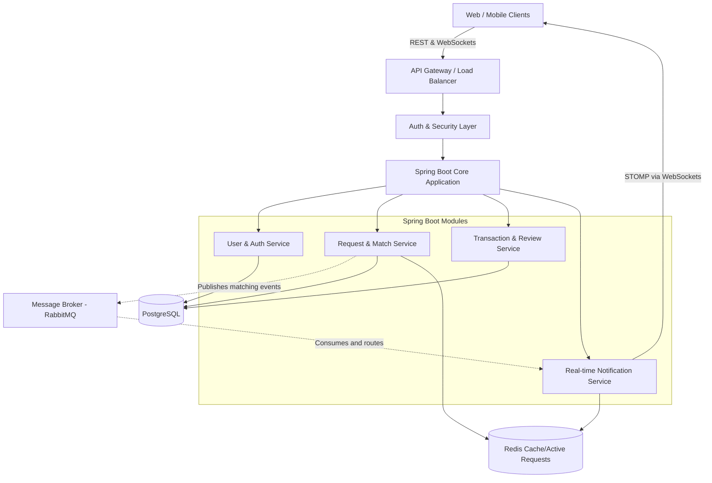

# System Architecture Design: University Peer-to-Peer Lending Platform

## 1. High-Level Overview

The platform operates as a decentralized, real-time matchmaking system between "Demand" (users needing items) and "Supply" (users owning items). The architecture is designed to handle thousands of concurrent students per campus with low latency and high reliability, using a modular monolith or microservices approach (we'll assume a modular monolith for Phase 1 MVP, which is easiest to scale on Day 1).

### Core Components:

1.  **Client Applications**: Web (React/Next.js) and Mobile (Flutter/React Native) for cross-platform availability.
2.  **API Gateway & Load Balancer**: Nginx or AWS API Gateway to route traffic, handle SSL termination, and rate limiting.
3.  **Application Server (Spring Boot)**: Contains core domains like User Context, Matching Engine, Notification Engine, and Transaction Engine.
4.  **Database (PostgreSQL)**: Primary datastore. Relational is chosen because entities (Users, Requests, Transactions, Reviews) have strict ACID requirements and strong relationships.
5.  **In-Memory Cache (Redis)**: 
    *   Caches active requests for fast regional searching.
    *   Stores WebSocket session details.
    *   Rate limiting for endpoints and fraud prevention.
6.  **Message Broker / Pub-Sub (RabbitMQ or Redis Pub/Sub)**: Decouples request creation from notification broadcast to prevent blocking the main thread during high traffic.

## 2. Component Architecture Diagram

## 3. Request & Matching Data Flow

1.  **Create Request**: Student A posts "Need Apple Charger, High Urgency". `POST /api/v1/requests` is called.
2.  **Persist & Broadcast**: The Request is saved to PostgreSQL. An event `RequestCreatedEvent` is fired into RabbitMQ.
3.  **Smart Match Processing**: A background worker consumes the event, queries Redis/Postgres for nearby users or users who have listed similar items in their inventory. It filters out users with a low trust score.
4.  **Notification Pipeline**: The Notification module receives the target list and pushes real-time WebSocket messages to those users.
5.  **Offer Creation**: Student B sees the ping, clicks "I have this", firing `POST /api/v1/requests/{id}/offers`.
6.  **Acceptance**: Student A gets a notification "Student B offered an Apple Charger (Rating: 4.8)". A accepts. 
7.  **Transaction Start**: `PUT /api/v1/transactions/{id}/status` marks it as `IN_PROGRESS`. Other bidders are automatically notified of rejection via WebSocket events.
8.  **Completion & Review**: Item returned, transaction closed, and both parties prompted to submit a Review.

## 4. Real-time System Strategy (WebSockets)

Since low-latency matching is crucial, HTTP polling is inefficient and drains mobile batteries. 
*   **Protocol**: WebSockets with STOMP (Simple Text Oriented Messaging Protocol) on top of Spring Boot.
*   **Connection**: Clients establish a persistent WS connection at startup: `ws://api.domain.com/ws`.
*   **Destinations**: 
    *   Subscribe to Personal Notifications: `/user/{userId}/queue/notifications`
    *   Subscribe to Local Campus Broadcasts: `/topic/campus/{campusId}/requests`
*   **Scaling WebSockets**: Since WebSocket connections are stateful, if you run multiple instances of the Spring Boot app, you need a full-featured broker (like RabbitMQ with STOMP plugin or Redis PubSub) to route messages to the correct server instance holding the user's connection.

## 5. Non-Functional Requirements Addressed

*   **Scalability**: Stateless REST APIs allow horizontal scaling of the Spring Boot pods. RabbitMQ buffers burst traffic (e.g., during final exam weeks when everyone needs chargers/books).
*   **Security**: JWT (JSON Web Tokens) for authentication. Role-based access control (`ROLE_STUDENT`, `ROLE_ADMIN`). Input validation prevents XSS and SQL injection.
*   **Fraud Prevention (Spam Detection)**: 
    *   Redis Token Bucket rate limiting: Prevent a user from posting > 3 requests per minute.
    *   Similarity matching: Reject back-to-back identical requests.
    *   Trust Score Thresholds: Restrict zero-rating users from borrowing high-value items until they build credibility.
