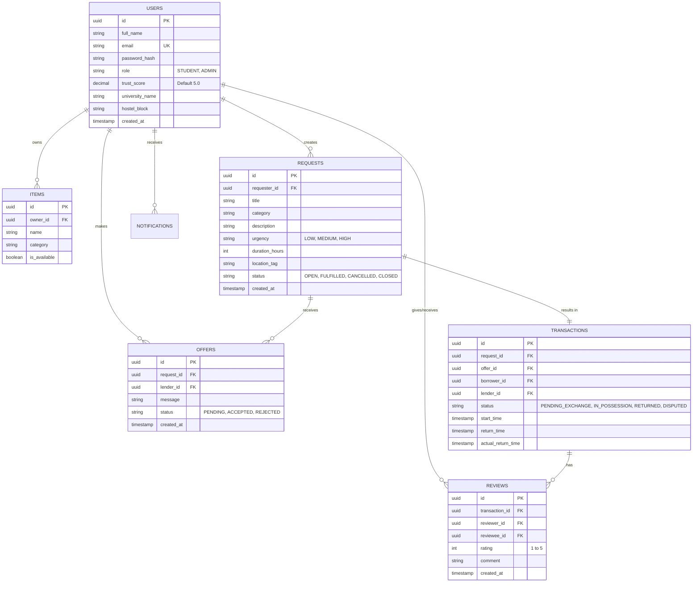

# Database Schema Design

A well-structured relational schema is vital for maintaining transactional integrity in a lending platform. We'll use **PostgreSQL**.

## 1. Entity-Relationship Diagram (ERD)

## 2. Table Schemas & Indexes

### A. Users Table
The central entity for authentication and credibility tracking.
*   `id` (UUID, Primary Key)
*   `email` (VARCHAR, Unique, Indexed for fast login)
*   `password_hash` (VARCHAR)
*   `trust_score` (DECIMAL, default 5.0) - Re-calculated asynchronously via batch job or triggered on every review.
*   `hostel_block` (VARCHAR) - Used for proximity matching.
*   **Indexes**: `idx_users_email`

### B. Requests Table
Represents the core "Demand".
*   `id` (UUID, Primary Key)
*   `requester_id` (UUID, Foreign Key)
*   `category` (VARCHAR) - e.g., 'ELECTRONICS', 'BOOKS', 'STATIONERY'.
*   `urgency` (VARCHAR) -> ENUM('LOW', 'MEDIUM', 'HIGH')
*   `status` (VARCHAR) -> ENUM('OPEN', 'FULFILLED', 'CANCELLED', 'CLOSED')
*   **Indexes**: `idx_requests_status_category` (Highly queried by the feed: `WHERE status='OPEN' AND category='...'`)

### C. Offers Table
Represents the "Supply" responding to Demand. Multiple lenders can bid.
*   `id` (UUID, Primary Key)
*   `request_id` (UUID, Foreign Key)
*   `lender_id` (UUID, Foreign Key)
*   `status` (VARCHAR) -> ENUM('PENDING', 'ACCEPTED', 'REJECTED')
*   **Constraint**: Unique index on `(request_id, lender_id)` to prevent spamming multiple offers on the same request.

### D. Transactions Table
Created only when an Offer is ACCEPTED. Tracks the actual physical exchange of the item.
*   `id` (UUID, Primary Key)
*   `request_id` (UUID, Foreign Key)
*   `lender_id` (UUID, Foreign Key)
*   `borrower_id` (UUID, Foreign Key)
*   `status` -> ENUM('PENDING_EXCHANGE', 'IN_POSSESSION', 'RETURNED', 'DISPUTED')
*   `due_date` (TIMESTAMP)

### 3. Scalability & Optimization Notes
1.  **Read-Heavy Feed**: The "Active Requests Feed" will be highly read. We should cache `SELECT * FROM requests WHERE status = 'OPEN'` in Redis, partitioned by campus/hostel_block to minimize DB hits.
2.  **Archiving**: Requests typically only live for 24-48 hours. Older, closed requests can be moved to a cold-storage table (Table Partitioning by date) to keep the primary read index extremely fast.
3.  **Denormalization for Speed**: The `Requests` feed might need the user's name and trust score. Instead of joining the `Users` table every time, we can save `requester_name` and `requester_trust_score` in Redis alongside the cached request.
